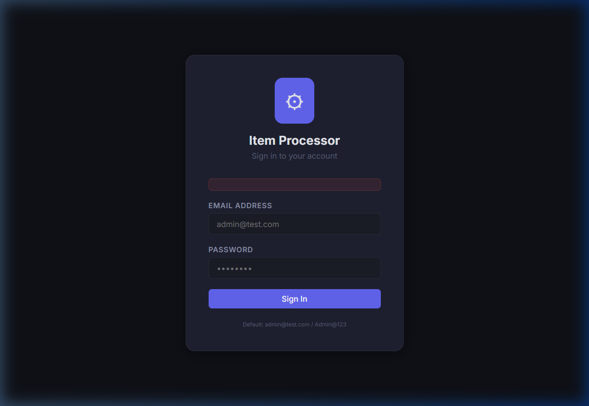
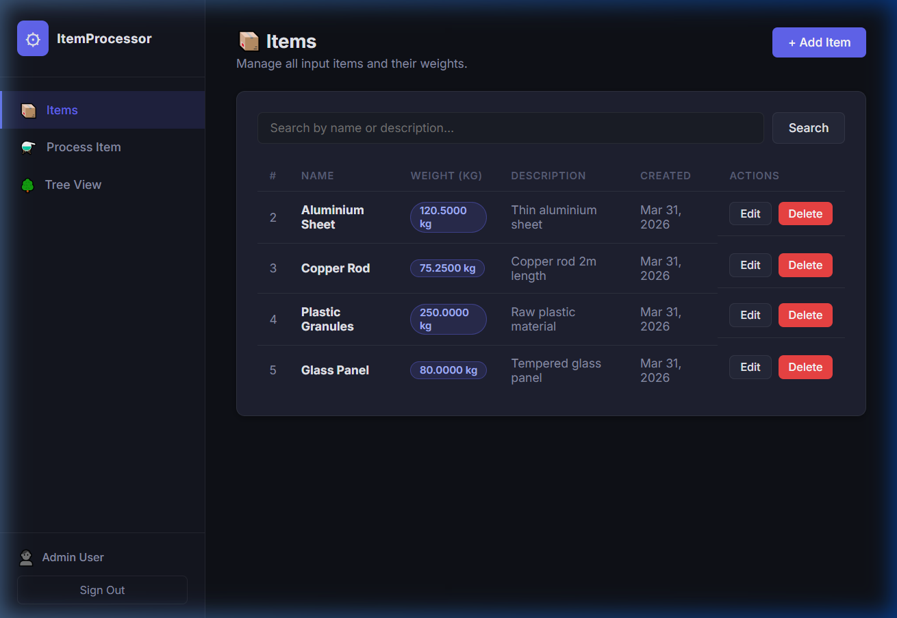
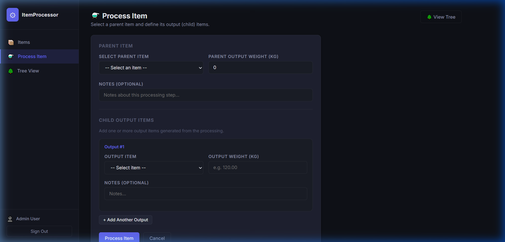
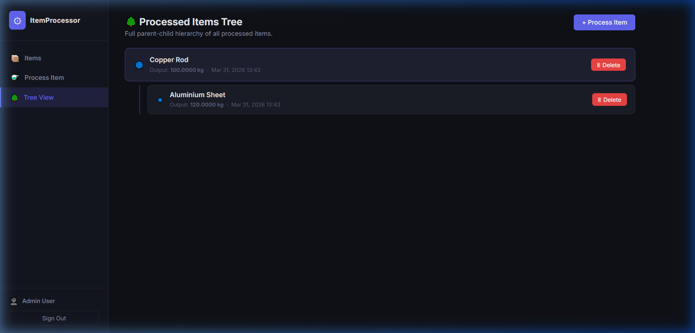

# UI/UX Design Report – Item Processor App

## Overview

The Item Processor application is designed with a **premium, developer-centric aesthetic** that balances high functionality with modern visual appeal. The goal was to create an interface that feels robust and professional, utilizing a dark theme to reduce eye strain and emphasize data visualization.

---

## Design Decisions

### 1. Visual Theme (Dark Mode)
- **Palette**: A deep charcoal (`#111827`) and navy (`#1a1f2e`) background was chosen to create a "Dashboard" feel.
- **Accent Colors**: Vivid violet-blue (`#6366f1`) is used for primary actions, while emergency actions like "Delete" use a danger red (`#ef4444`).
- **Glassmorphism**: The sidebar and cards use subtle transparency and backdrop-blur effects to create depth, a hallmark of modern premium web apps.

### 2. User Flow & Navigation
- **Persistent Sidebar**: Provides quick access to all modules (Items, Process, Tree View).
- **One-Click Actions**: Critical tasks like adding or searching items are always available via primary buttons in the header.
- **Feedback Loops**: Success toasts and validation messages are color-coded to provide instant confirmation of user actions.

### 3. Tree Visualization
- **Recursive Pattern**: To address the "Parent/Child" relationship, a hierarchical tree view shows the flow of weights across processes.
- **Indentation & Icons**: Clear indentation and branch icons help users trace the source of each sub-item instantly.

---

## Application Screens

### 🔐 Login

*A centered, minimalist login card with secure input fields and clear primary action.*

### 📦 Item Management

*Tabular data layout with integrated search and quick CRUD actions.*

### ⚗️ Item Processing

*Dynamic form that allows adding multiple child output items in a single transaction.*

### 🌳 Recursive Tree View

*Visual representation of the parent-child item hierarchy.*

---

## Technical Implementation
- **Styling**: Vanilla CSS with CSS Variables for theme consistency.
- **Typography**: Inter / System Sans-Serif for maximum readability.
- **Icons**: Emoji-based category icons for a lightweight, modern feel without external dependencies.
